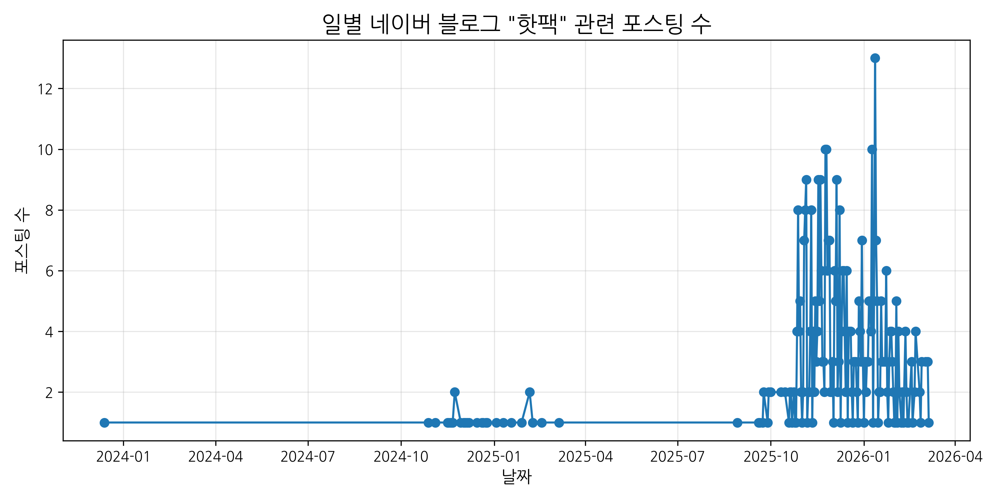
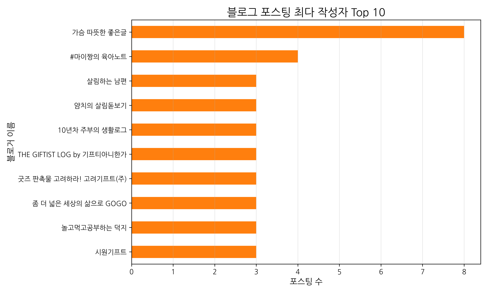
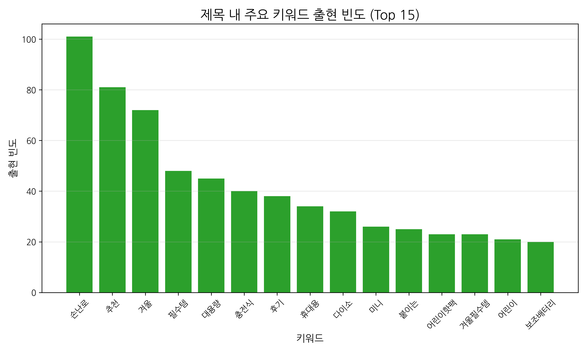

# 네이버 블로그 검색 데이터 EDA 분석 리포트 ('핫팩')

> **데이터 파일:** `hotpack_blog_results_20260306_204042.csv`

## 1. 개요 및 데이터 기초 통계
수집된 네이버 블로그 검색 결과를 바탕으로 핫팩 관련 키워드 트렌드와 작성자 분포를 탐색적 데이터 분석(EDA)을 통해 확인합니다.

- **분석 기간:** 2023-12-13 ~ 2026-03-06
- **총 수집 포스트:** 500개
- **관여한 고유 블로거 수:** 423명

---

## 2. 일별 포스팅 트렌드
수집된 기간 동안 핫팩과 관련된 포스팅이 하루에 몇 건씩 작성되고 있는지 시계열로 나타냅니다.

> **인사이트:** 특정 이벤트나 리뷰 시즌(겨울 등)에 게시물이 크게 치솟는 일자를 확인할 수 있습니다.

---

## 3. Top 10 작성자 (인플루언서 / 마케팅 활성 블로그)
핫팩 관련 게시글을 가장 활발하게 작성한 상위 10명의 블로거 목록입니다.

> **인사이트:** 전문 리뷰어나 홍보 블로그 등 핫팩 아이템과 밀접하게 연관된 핵심 크리에이터들을 파악할 수 있습니다. 상위 랭커의 글 패턴을 심층 분석하면 바이럴 마케팅 전략 수립에 도움이 될 수 있습니다.

---

## 4. 제목 텍스트 주요 키워드 분석
제목에 '핫팩'과 함께 가장 많이 언급된 동시출현 키워드 Top 15를 시각화했습니다.

> **인사이트:** 소비자나 작가들이 핫팩(본질적 상품)과 함께 가장 중요하게 묶어서 이야기하는 속성(예: '군용', '대용량', '붙이는', '리뷰', '추천')이 무엇인지 확인할 수 있습니다.
